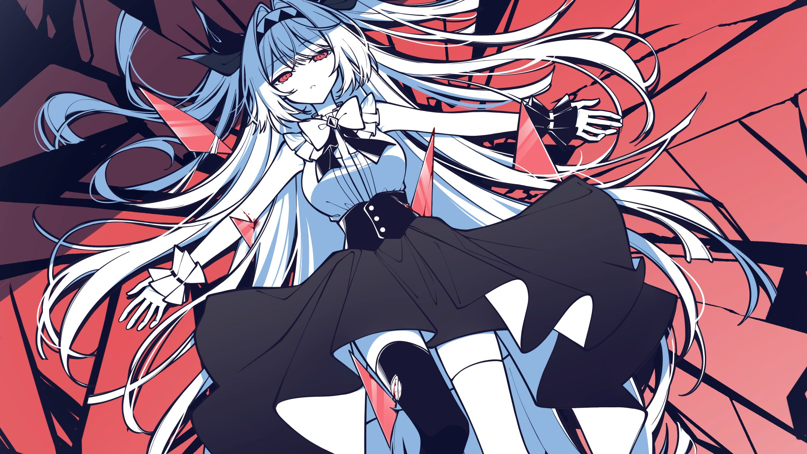

<h1 align="center">👋 Hello World! I'm Yuuki</h1>

  

  

### Welcome to my digital hideout 🍃✨

Halo, aku **Yuuki** – seorang passionate developer yang suka bikin tools digital dan explore berbagai dunia gaming.

⚖️ **Striving to balance** my life between lines of code and my personal passions. 💻 I spend most of my free time building digital tools using the **PHP/XAMPP stack**, currently focusing on optimizing an anime tracking app and managing my digital collectibles. 🌸 *(Self-proclaimed devotee of Elaina)*. 

🎮 **When I'm not wrestling with a debugger**, you can probably find me exploring the worlds of **Genshin Impact** and **Wuthering Waves**, climbing the ranks in **Mobile Legends**, or immersed in **The Noexistence of You and Me** (always spending time with **Lilith**). 

💬 **I'm always open** to chatting about API integrations, CSS tweaks, or swapping anime recommendations!

  

---

### ✍️ Random Dev Quote

  

### ✨ GitHub Stats

  

  

### 🔥 Top Languages

  

### 🧰 Tech Stack & Tools I Use

  
  
  
  
  
  

### 🌍 Social Media & Connect

  
  
  

---

### 🎨 My Favorites

- 🎮 **Games**: Genshin Impact, Wuthering Waves, Mobile Legends, The Noexistence of You and Me
- 🌸 **Anime Icons**: Elaina, Lilith
- 🎵 **Dev Vibe**: Anime soundtracks & lofi beats
- 💡 **Current Focus**: PHP API optimization, Flutter mobile apps, anime tracking systems

### 🍃 Cozy Hideout

> "Code today, explore tomorrow. And always spend time with Lilith." 

  

---

  Thanks for visiting my profile! ✨
   
  🌙 Sweet dreams are made of anime and code 🌙

